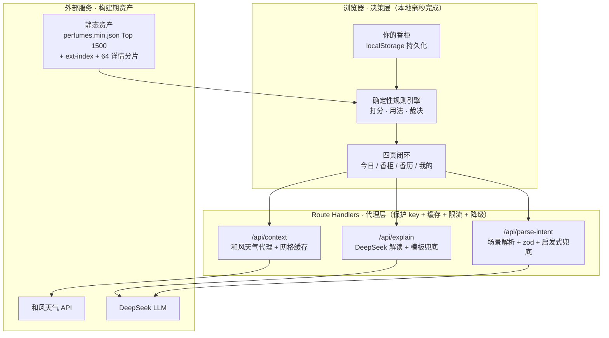

# 开发与维护

面向开发者与维护者：架构、配置、开发、部署、维护与故障排查。产品定位见[产品方案](氛寸-产品方案.md)，规则依据见[领域规则手册](领域规则手册.md)，数据管线见[数据工程](数据工程.md)，用户可见的文字见[声音与文案](声音与文案.md)。

本文与代码不一致时以代码为准，然后修本文。源码路径省略 `src/lib/`。

## 1. 架构

### 1.1 决策权在规则引擎，表达权在 LLM

打分、喷量、位置、社交距离、留香与裁决全部由确定性规则计算，可解释、可复现、可单测。DeepSeek 只在两端工作：把一句话场景解析成结构化情境；把规则算好的事实翻成人话。天气只来自和风天气 API。

| 任务 | 谁做 | 为什么 |
|---|---|---|
| 匹配打分、排序 | 规则引擎 | LLM 打分不可复现；规则每一分都能拆给用户看 |
| 喷量 / 部位 / 距离 / 风险 | 规则引擎 | 这是产品壁垒，交给 LLM 会产生幻觉 |
| 自然语言 → 结构化情境 | LLM | 规则穷举不了「去前任婚礼」「第一次见投资人」 |
| 把结论翻成有温度的解释 | LLM | 只能基于给定事实，不准改结论；输出还要过数字白名单与语义校验 |

### 1.2 三层

重计算（打分）在浏览器本地，重 key（天气、LLM）在服务端，重数据在构建期固化成静态资产，三者不混。

### 1.3 全链路降级

| 失效 | 降级 |
|---|---|
| 定位失败或和风不可用 | 按季节与时段推断近似情境（`Context.approximate`）：不出天气断言，天气不参与裁决，不弹天气预警，不调 LLM |
| DeepSeek 没配 key、限流、日闸门触顶、超时、空正文、非法 JSON | 解读退回确定性模板（`api/explain/route.ts:template`），场景解析退回关键词启发式（`api/parse-intent/route.ts:heuristic`） |
| LLM 输出出现事实之外的数字、把 avoid 说软、把 good 说成不建议、无香场合劝用 | 整段丢弃，退回模板 |
| 目录加载失败 | 告知并可重试，不把满柜显示成空柜 |

红线不许只挂在降级路径上：无香场合的关键词守卫与 LLM 提示词双路并行、取并集。

### 1.4 本机数据

香柜、反馈、香历与手记全部存在浏览器 `localStorage`（键 `fencun-store`），服务端不保存用户数据，没有账号与云同步。只有这一份副本，`store.ts` 守住四件事：

- 读盘失败时把原始字节另存到 `fencun-store.bak`，冻结后续写入并在页面顶部告知；
- 检测到本站数据被外部清除（`isStorageWipe`）时同样冻结写入，不把内存态写回盘；
- 写盘失败时保住当前会话状态并提示导出（`guardedStorage` + `persistError`）；
- 另一个标签页写盘后跟着重读（`shouldRehydrateOnStorage`），避免整包覆盖。

持久化结构带版本号 `PERSIST_VERSION`（现为 2）：改动 `partialize` 的字段结构时 +1，并在 `migrate` 里补迁移分支。导出文件另有 `EXPORT_VERSION`，两者各自演进；导入前先经 `import-schema.ts:parseBackup` 解析预览，再整包替换。示例香柜只在真正没有用户数据时装载，判据只有 `hasOwnData` 一处：柜空但香历、反馈或行为计数还在，不算新设备。

## 2. 仓库结构

顶层目录见 [README · 目录结构](../README.md#目录结构)。`src/lib/` 逐文件：

| 文件 | 职责 |
|---|---|
| `types.ts` | 类型契约：香水、情境、用法、裁决、反馈、香历 |
| `season.ts` | 季节、体感四态、温度四档、时段 |
| `scoring.ts` | 香调家族、主导度判据、打分、天气归因 |
| `occasion-priors.ts` | 场合先验（风格权重）与空间密度 |
| `usage.ts` | 喷量、位置、风险文案、「为什么」要点 |
| `recommend.ts` | 裁决、排序与轮换、备选、反馈聚合 |
| `format.ts` | 档位话术的单一出处 |
| `numguard.ts` | 数字白名单 |
| `perfumes.ts` / `catalog.ts` | 统一搜索与扩展索引 / 目录加载与详情分片 |
| `journal.ts` / `nudges.ts` / `demo.ts` | 香历 / 发现型钩子（纯函数，`now` 是入参）/ 示例香柜 |
| `store.ts` / `import-schema.ts` | 持久化与守卫 / 备份文件解析 |
| `ratelimit.ts` / `llmlog.ts` | 限流、日闸门、来源校验 / 降级记账 |
| `hooks.ts` | 页面编排：情境合成、解读请求、缓存与防抖 |

`scripts/` 里是数据管线（`extract-terms` / `build` / `build-ext` / `derive`）、门面素材（`shot` / `og`）与依赖审计门禁（`audit-gate`）。

## 3. 环境与配置

### 3.1 运行时

需要 Node 24。`package.json` 的 `engines.node` 是唯一事实源：Vercel 直接读它并覆盖项目面板的设置。升级运行时要同步三处到同一个大版本：`engines.node`、`.github/workflows/ci.yml` 的 `node-version`、`@types/node`（Dependabot 对它的 major 更新设了 ignore）；再同步两处面向人的复述：README「本地运行」与本节。

安装、运行与提交前检查的命令见 [README · 本地运行](../README.md#本地运行)。

### 3.2 环境变量

复制 `.env.example` 为 `.env.local`。不配任何 key 也能跑：天气走「季节 + 时段」降级，解读走规则模板，场景解析走关键词启发式。

| 变量 | 用途 | 默认 |
|---|---|---|
| `QWEATHER_HOST` / `QWEATHER_KEY` | 和风天气，仅服务端调用。Host 是控制台分配的专属 API Host，不含 `https://` | 未配置则天气降级 |
| `DEEPSEEK_API_KEY` | 场景解析与解读 | 未配置则走模板与启发式 |
| `DEEPSEEK_BASE_URL` / `DEEPSEEK_MODEL` | 接口地址与模型 | `https://api.deepseek.com` / `deepseek-v4-flash` |
| `LLM_DAILY_CAP` | 两条 LLM 路由合计的上游日调用上限 | 3000 |
| `WEATHER_DAILY_CAP` | 和风日调用上限。免费额度 5 万次 / 月由天气与 GeoAPI 共用，一次缓存 miss 打两次上游 | 800 |
| `NEXT_PUBLIC_SITE_URL` | 自部署域名，用于 canonical、sitemap 与分享卡片的绝对 URL | `https://fencun.vercel.app` |

申请入口：和风天气在 [console.qweather.com](https://console.qweather.com) 创建项目与凭据，DeepSeek 在 [platform.deepseek.com](https://platform.deepseek.com) 创建 API key。

日闸门按函数实例计数，Serverless 冷启动即归零；取不到有效正整数时回退默认值并记一条 warn。它是纵深防御，替代不了 DeepSeek 与和风控制台里的账户消费上限。

## 4. 开发

### 4.1 测试

`npm test` 是 `node --test` 加一份手写清单，当前 147 个用例：

| 文件 | 覆盖 |
|---|---|
| `engine.test.ts` | 打分、喷量、裁决、归因、排序不变式、无幽灵香调键、搜索排序规则 |
| `src/app/api/route.test.ts` | 数字白名单、裁决语义防线、无香场合、降级模板、场景解析 schema |
| `store.test.ts` / `store-wipe.test.ts` | 持久化守卫、导入导出、多标签页、盘被抹掉 |
| `demo.test.ts` | 示例香柜：四季钩子不变式、退场语义 |
| `nudges.test.ts` / `journal.test.ts` / `theme.test.ts` | 发现型钩子 / 香历 / 主题默认值 |
| `search.test.ts` | 真实构建产物上的端到端搜索回归 |
| `scripts/ci-workflow.test.mjs` | CI 门禁本身：gitleaks 全历史、审计门禁、测试清单覆盖全仓、源码无裸控制字符 |

三条约束由 `ci-workflow.test.mjs` 守着：

- 新增 `*.test.ts` / `*.test.mjs` 必须加进 `package.json` 的 `test` 脚本，否则永远不会被执行。不用 glob，是因为 `node --test` 的 glob 展开在不同 Node 版本上行为不一。
- 源码里不许出现裸控制字符（`\t` `\n` `\r` 除外），要表达就写转义形态 `/[\x00-\x1f]/`。裸字节会让 git 把整个文件判成二进制，PR 里看不见 diff，gitleaks 也扫不到。
- 依赖审计的每条豁免都要写清「为什么无解」与「什么条件下能删」。

排查引擎行为最可靠的方式是用 `node --import tsx` 直接跑纯函数（`recommend()` / `buildPick()`）。临时脚本命名为 `*-probe.*` 或放进 `.scratch/`，两处都被 git 与 eslint 忽略；放在别处会被 lint 扫到。

### 4.2 lint

`npm run lint` 的基线是 0 error / 8 warning。8 条 warning 来自 `react-hooks/set-state-in-effect` 与 `react-hooks/purity`：本项目未启用 React Compiler，这两条会对「挂载后同步 setState 以规避水合不匹配」等有意模式误报，已在 `eslint.config.mjs` 降为 warn。

### 4.3 用例守住的承诺

凡是对用户说出口的话，都要有一条测试守着。当前必须成立的：

- 正常路径与降级路径走同一条安全红线；无香场合不能只靠 LLM，也不能只在没配 key 时才生效；
- avoid 不许被 LLM 说软，good 不许被说成不建议；LLM 的空正文、非法 JSON、超时与限流都要退回模板；
- 数字白名单覆盖半角、全角、中文数词、「半」与距离量词；用户原话不得反向扩大白名单；
- 示例数据只在真正没有用户数据时装载；「柜空但香历 / 反馈 / 行为计数还在」不算新设备；
- 读盘失败、写盘失败与盘被抹掉都要明确告知，并监听其他标签页的存储变化；
- 删除香水后香历保留名称与情境快照，反馈与短期换瓶状态随瓶清理；撤销恢复香水与反馈，不恢复已清理的短期状态；采纳可撤销，且撤销要还原一串采纳；
- 依赖日期或季节的提醒与示例排期，用例跑满四季与本地零点边界；
- 主目录与扩展集共用的规则用真实构建产物做回归。

## 5. API 路由与防线

| 路由 | 上游 | 单客户端限流 | 日闸门 | 超时 | 其他 |
|---|---|---|---|---|---|
| `GET /api/context` | 和风天气 | 20 次 / 60 秒 | `WEATHER_DAILY_CAP`，在 `qweather()` 里按上游调用计数 | 8 s | 校验坐标范围与城市名长度；进程内 30 分钟网格缓存（0.01° 粒度）；城市反查缓存 24 h，查不到的负缓存 10 分钟；成功响应带 `s-maxage=300`，错误响应不带 |
| `POST /api/explain` | DeepSeek | 8 次 / 10 秒 | `LLM_DAILY_CAP` | 15 s | 同源校验；正文 ≤ 8 KB 按 `Content-Length` 早退；入参 zod，超长字段截断而非拒收；`thinking` 关闭，`max_tokens` 1024；出参过数字白名单、单位配对、裁决语义与无香场合校验 |
| `POST /api/parse-intent` | DeepSeek | 8 次 / 10 秒 | `LLM_DAILY_CAP` | 12 s | 同源校验；正文 ≤ 1 KB，`text` 截断到 120 字；`json_object` + zod；带数字的 `riskNote` 整条丢弃；无香场合取 LLM 与关键词启发式的并集 |

- 限流挡单客户端狂刷，日闸门挡换 IP 的分布式刷量。两条 LLM 路由的顺序是 `KEY → allow() → withinDailyBudget()`，三者都会消费计数，不要调换。
- 同源校验（`ratelimit.ts:fromOwnPage`）：`Content-Type` 必须是 JSON，`Sec-Fetch-Site` 存在时必须是 `same-origin`。跨源请求返回 403，不产出降级模板。
- 客户端标识优先读 Vercel 平台头 `x-vercel-forwarded-for`。自托管在 append 型反向代理后面时，`x-forwarded-for` 首元素可伪造，应在最外层代理覆写它。
- `deepseek-v4-flash` 是思考型模型，思考默认开启且推理 token 计入 `max_tokens`。两条路由都传 `thinking: { type: "disabled" }`。
- 每条降级路径按原因记账（`llmlog.ts`）：上游坏了记 `error`（`upstream_status` / `timeout` / `upstream_error`），按设计降级记 `warn`（`no_key` / `rate_limited` / `budget_exhausted` / `bad_shape` / `guard`）。`no_key` 与 `budget_exhausted` 每实例只记一次，`rate_limited` 60 秒一条。日志里凭据形态的串一律抹掉，不记用户原话。

## 6. 部署

- `main` 分支推送后由 Vercel 自动构建部署，PR 有预览部署。运行时版本由 `engines.node` 决定（§3.1），环境变量在 Vercel 项目里配置（§3.2）。
- `.vercelignore` 排除 `ledecanteur`、`.scratch` 与 `docs`；数据管线不在应用构建里跑，构建机不碰原始数据。
- `next.config.ts` 给全站加 `X-Content-Type-Options: nosniff`、`Referrer-Policy: strict-origin-when-cross-origin`、`X-Frame-Options: DENY`、`Permissions-Policy: geolocation=(self)`，以及 CSP 的 `base-uri` / `form-action` / `object-src` / `frame-ancestors` 四条。`script-src` 未设：Next 的运行时内联脚本与主题切换脚本需要 nonce 方案，放宽到 `unsafe-inline` 没有防护价值。
- `/data/*` 响应 `max-age=3600, stale-while-revalidate=86400`。路径不带版本号，所以不能 `immutable`，构建更新一小时内可见。
- 限流与日闸门都是每实例的，实例越多总量越高。真正的硬保险是在 DeepSeek 与和风控制台给账户设消费上限与告警。

## 7. 维护

### 7.1 CI 与门禁

| 作业 | 内容 |
|---|---|
| verify | `npm ci` → 依赖审计 → lint → test → build。审计走 `scripts/audit-gate.mjs`：全树 `npm audit`，high / critical 一律红，只放行 `ALLOW` 里逐条写明理由与退出条件的公告；清单为空是正常状态 |
| reuse | 每个文件都要带 SPDX 版权与许可标注（`fsfe/reuse-action`） |
| gitleaks | 扫描完整可达历史，镜像按 `docker://…@sha256` 摘要钉死 |
| CodeQL | push、PR 与每周一定时分析 javascript-typescript |

所有第三方 Action 按 commit SHA 钉住并注明版本。Dependabot 的 github-actions 生态不跟进 `docker://` 引用，gitleaks 的摘要要手动核对上游 release 后更新，改时连注释里的 tag 一起改。

### 7.2 依赖

- Dependabot：npm 每周检查，minor / patch 攒成一条 PR，major 各自单开；安全更新走独立分组；GitHub Actions 月更。
- 三个 major 被有意挡住，理由写在 `dependabot.yml`：eslint 10 与 typescript 7 受 `eslint-config-next` 内置插件的 peer 范围限制，`@types/node` 跟随运行时大版本。解禁前先核 peer 声明，达标后手动升级。
- 判断某个版本能不能用看 `npm view <pkg> versions`，不看 dist-tag；核滞后的传递依赖用 `npm outdated --all`，只跑 `npm outdated` 会漏。
- 给 `audit-gate.mjs` 加豁免前先问：是真的无解，还是只是升级麻烦。豁免不再触发时脚本会提示删除。

### 7.3 数据

仓库已含构建产物。重建步骤、口径与不变量见[数据工程 · 可复现性与验证](数据工程.md#八可复现性与验证)。

### 7.4 门面素材

README 截图与分享卡片由无头浏览器拍站点自己的页面，命令见 [README · 本地运行](../README.md#本地运行)。补充：

- 必须起生产服务器，`next dev` 的调试悬浮球会入镜。
- `npm run shot` 不另设种子：脚本清空 localStorage，拍到的就是首访者看到的示例香柜；时间被冻结在脚本里写死的日期。`SHOT_ONLY=<name>` 只拍一屏。
- `npm run og` 产出 `public/og.png`、三个 PWA 图标、`apple-touch-icon.png` 与 `src/app/favicon.ico`，版式取自站点自身的 CSS 变量，改了字体或配色 token 后要重新生成。
- 服务器刚起时第一拍有冷缓存抖动，比对「有没有变」要连拍两次自比。
- 换完截图后把 `docs/screenshots/` 里的版本号与 README 引用一起改。

### 7.5 版权与许可

- 源代码 AGPL-3.0-only，附 §7 商标条款：「氛寸」「FenCun」「Fēn Cùn」的名称、标识与视觉形象不在授权范围内。
- 每个源文件顶部带 SPDX 头；`REUSE.toml` 再按目录聚合声明一遍，因为 reuse 只读文件开头一小段猜编码，中文注释密集的文件会被判成二进制而跳过头部。
- `public/data/**` 派生自 ledecanteur / Fragrantica 社区数据，不随代码按 AGPL 授权，条款在 `LICENSES/LicenseRef-fragrance-data.txt`。行为准则是 Contributor Covenant 3.0 的改编版，按 CC BY-SA 4.0 发布。
- 随产物分发的字体（Fraunces、Noto Serif SC，均为 OFL 1.1）与直接依赖列在 `THIRD-PARTY-NOTICES.md`。
- 改数据范围、字段或许可声明时，`REUSE.toml`、`THIRD-PARTY-NOTICES.md`、`LICENSES/` 与 README 的许可段落一起核。

## 8. 故障排查

### 8.1 解读一直是模板

推荐卡眉标写「氛寸 · 用香建议」而不是「氛寸 · 此刻为你解读」，说明 `/api/explain` 走了降级。在 Vercel 日志里按 `降级` 过滤，形态是 `[explain] 降级 <kind> status=… at=… ms=… detail=…`：

| kind | 含义 | 处置 |
|---|---|---|
| `no_key` | 没配 `DEEPSEEK_API_KEY` | 配环境变量后重新部署 |
| `rate_limited` | 单客户端超过 8 次 / 10 秒 | 看是不是脚本在刷 |
| `budget_exhausted` | 当天实例额度用完 | 调 `LLM_DAILY_CAP`，或等冷启动归零 |
| `upstream_status` | 上游非 2xx。`detail` 里 401 是 key 无效，402 是余额不足 | 轮换 key / 充值 |
| `timeout` | 15 s（explain）/ 12 s（parse-intent）内没返回 | 看 `ms`，区分卡死与慢 |
| `upstream_error` | 连不通，`detail` 带 `cause.code` | 网络与 `DEEPSEEK_BASE_URL` |
| `bad_shape` | 200 但没有可用正文。`finish=length content=0 reasoning>0` 是思考模式没关；`finish=content_filter` 是被上游策略拦 | 核对请求体里的 `thinking` 是否被中间层吃掉 |
| `guard` | 防线拦下模型输出，`at` 写明是哪一道，`detail` 是被拦的数字 | 频繁出现再考虑收紧或放宽 |

本地不配 key 时只会有一条 `no_key` warn，这是正常状态。

### 8.2 情境栏「还没拿到天气」

`/api/context` 的错误都以 `{ error }` 返回 200（入参非法除外），客户端据此走降级链：

| error | 含义 |
|---|---|
| `weather_unconfigured` | 没配 `QWEATHER_HOST` / `QWEATHER_KEY` |
| `rate_limited` | 单客户端超过 20 次 / 60 秒，响应带 `Retry-After: 60` |
| `bad_coords` / `bad_city` / `missing_location` | 入参非法，400 |
| `city_not_found` | 城市名反查为空，负缓存 10 分钟 |
| `weather_failed` | 上游返回了但 `code !== "200"` 或没有 `now` |
| `weather_unavailable` | 上游异常或日闸门触顶。上游细节只进服务端日志：`[api/context] upstream error: qweather <status>` |

`qweather 401` 是凭据或 Host 不对，`403` / `429` 是配额。城市来源由 `store.ts:cityOrigin` 记录（manual / geo / demo / none）：用户手动填过城市就不再请求定位，其余来源都会并行请求定位，成功则以定位为准；示例香柜自带北京。

### 8.3 本机数据

- 读盘失败时原始字节在 `localStorage` 的 `fencun-store.bak`，页面顶部会告知；写入已冻结，先让用户导出。
- 用户清除站点数据后页面不会把内存态写回盘，刷新即为空柜，这是预期行为。
- 「我的」页的导出文件带 `EXPORT_VERSION`，导入走 `parseBackup` 预览后整包替换。

### 8.4 本地开发

- Windows 上 `pkill` 杀不掉 `next start`，端口会被旧构建占着，页面拿到失效 chunk：按端口找进程结束（`Get-NetTCPConnection -LocalPort 3100`）。
- Turbopack 的 chunk 名不含内容哈希，改了 CSS 重新构建后同名 URL 可能仍被浏览器缓存，验证样式改动前先强制刷新。
- `next dev` 会覆盖 `.next`，之后 `next start` 报没有生产构建，重新 `npm run build`。

## 9. 已知约束

- **和风天气两条日期。** 官方已把 `/v7/weather/now` 标记为即将弃用（公告的停止供数日期为 2027-08-01），替代接口是 `GET /weather/v1/current/{纬度}/{经度}`；2027-01-01 起 API KEY 认证的每日请求数受限（公告为 1000 次 / 天，帐号级），JWT 不受限。GeoAPI `/geo/v2/city/lookup` 不受影响。迁移要点：v1 纬度在前、最多两位小数，与 `gridKey` 的粒度一致；`humidity` 是 0–1 的比例而非百分数，全项目湿度阈值按 0–100 写（`season.ts`、情境栏、numguard），漏换算不会报错，只会让闷热与回潮两条规则静默失效；字段路径 `now.temp` → `temperature.value`（数字）、`now.text` → `condition.text`；JWT 用 `node:crypto` 的 Ed25519 签名即可，不必引库；v1 文档只给了 JWT 示例，是否接受 API KEY 要用真实凭据实测。
- **天气 avoid 是二元阈值**（`heatLoad ≥ 0.9`，约 33.7℃）：临界温度两侧会出现裁决跳变。它直接决定劝退范围，是产品决策；要动就连边界用例一起补，并在「保持严格」与「降低阈值」之间显式选一个。
- **本机计数支撑不了效果结论**：换香率与吃灰采纳率只在这一台机器上累加，没有服务端事件与跨用户聚合。口径见[产品方案 · 指标](氛寸-产品方案.md#九--壁垒指标与商业)。
- **限流与日闸门都是每实例的**，见 §6。
- **截图与分享脚本只认 Windows 上的 Chrome / Edge 路径**（`scripts/shot.mjs:CHROME_CANDIDATES`），换平台先改这份清单。
